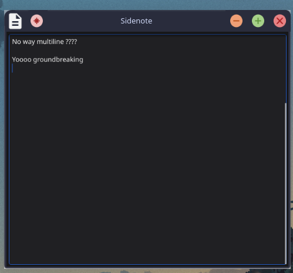

# Sidenote


A minimalist, auto-saving note-taking app for Linux.



## Features

- **Zero buttons, zero menus** - Just type
- **Auto-save on every keystroke** - Wow

## Installation

### From Source
```bash
git clone https://github.com/yamouri/sidenote.git
cd sidenote
go mod tidy
go build -o sidenote
sudo cp sidenote /usr/local/bin/
```

## Dependencies

- Go 1.21+
- Fyne 

## Usage

```bash
# Launch the app
sidenote

# Show help
sidenote --help
sidenote -h

# Backup current notes and create new file
sidenote --clean
sidenote -c

# More info
- Your notes are automatically saved to ~/.config/Sidenote/sidenote.txt
```

